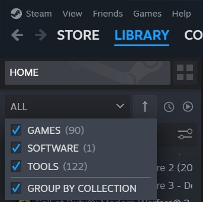

# Local DayZ Server

Here we will see how to install and set up a DayZ Standalone server on a Windows computer or server.


## Prerequisites
- Windows computer/server
  - with [Steam](https://store.steampowered.com/) installed
- Steam account

## Installation
The first step is downloading the server files. This can easily be done through Steam.

1. Fire up Steam
2. Go to your `Library`
3. At the top where it says `Games` change that to include `Tools`



4. You'll see `DayZ Server` among the results. Select it
5. Click `Install`
6. You'll notice on your desktop there'll be a shortcut to launch the server

::: warning
Don't launch the DayZ server yet!
:::

## Initialization

1. Open up your File Explorer
2. Move to the Dayz Server directory

::: info
The DayZ Server directory should be something along the lines of:

`C:\Program Files (x86)\Steam\steamapps\common\DayZServer`.

In the remainder of this guide we will assume that this is where your DayZ Server directory is.
:::

::: info
This is what you would see is if you were looking at the file structure on a remote server; 
:::

3. Create a new text file; call it `start.bat`
4. Using your favorite text editor, paste this into your `start.bat` file:

```batch
@echo off
:start
::Server files location
set serverLocation="C:\Program Files (x86)\Steam\steamapps\common\DayZServer"
::Server Port
set serverPort=2302
::Server config
set serverConfig=serverDZ.cfg
::Server profile
set serverProfiles=profiles
::Logical CPU cores to use (Equal or less than available)
set serverCPU=4
:: Go to DayZServer location
cd "%serverLocation%"
::Launch parameters (edit end: -profiles=|-config=|-port=|-cpuCount=|-doLogs|-adminLog|-netLog|-freezeCheck|-filePatching|-BEpath=)
start "DayZ Server" /min "DayZServer_x64.exe" -config=%serverConfig% -port=%serverPort% -profiles=%serverProfiles% -cpuCount=%serverCPU% -dologs -adminlog -netlog -freezecheck
```

::: tip
See the [Launch Parameters](./launch-parameters) page for more info on the meaning of each parameter.
:::

Don't worry if you don't have a `serverDZ.cfg` in your DayZ Server directory; we're going to create one in just a minute.

## Configuration
The config file `serverDZ.cfg` sets all of the parameters that the server needs in order to know how to behave.

You can find an example [here](./configuration-file#configuration)

::: warning
If you haven't changed any of the settings so far, then make sure that the config file is saved in the same folder as the `start.bat` file.

Ideally, this should be the following folder:

`C:\Program Files (x86)\Steam\steamapps\common\DayZServer`
:::

## Server profile
When the server starts up it's going to create a folder (whose name depends on what you set as argument to
the `-profiles` parameter) and within that folder it's going to put your log files.

Also, very importantly, this is where you are eventually going to put
the files that will allow you to be recognized as an admin; in other words, that's where your server
will look in order to verify your claim to be an admin.

## Start It

Open a new terminal and run the `start.bat` script with:
```powershell
.\start.bat
```
If everything worked correctly you will get a little window with some logs.

## Join It

1. Fire up the DayZ launcher
2. Go to `Servers`
3. Go to `LAN`
4. Click on `Join`
5. Congrats! You are now playing on your own local DayZ server!

## Stop It

Create a new file called `stop.bat`; it will look like this:
```batch
taskkill /f /im DayZServer_x64.exe
```

Then, just like before, open a new terminal and run the `stop.bat` script with:
```powershell
.\stop.bat
```

## Reset / Wipe 
1. Go to the missions folder (e.g. `C:\Program Files (x86)\Steam\steamapps\common\DayZServer\mpmissions` )
2. Open the folder of the particular mission you are running (e.g. `dayzOffline.chernarusplus`)
3. Open the `storage_1` folder
4. Delete its content

::: tip
An easier and quicker solution could be to leave your `DayZServer` folder vanilla, copy it with a different name (e.g. `DayZServerChernarus`), then when a
reset / wipe is required you can just delete the custom folder and copy your `DayZServer1` folder again, assigning it the same name as before
(e.g. `DayZServerChernarus`).
:::

### Return XMLs To Vanilla
1. Go to Bohemia Interactive's [DayZ Central Economy GitHub repository](https://github.com/BohemiaInteractive/DayZ-Central-Economy)
2. Download the vanilla files (folders) for Chernarus and/or Livonia: `dayzOffline.chernarusplus` and/or `dayzOffline.enoch`
3. Go to the missions folder (e.g. `C:\Program Files (x86)\Steam\steamapps\common\DayZServer\mpmissions` )
4. Replace the missions folder with those you have downloaded from Bohemia Interactive

## Mod installation

- Open the [DayZ Workshop page](https://steamcommunity.com/app/221100/workshop/).
- Select the mod you want to install and open its page
- Click on the `Subscribe` button
  - This will download the mod on your computer
- Find the mod folder on your computer
  - it should be placed in a folder like: `C:\Program Files (x86)\Steam\steamapps\common\DayZ\!Workshop`

::: warning
If you cannot find the `!Workshop` folder change your view settings to show hidden folders.
:::

- Copy the folder
  - The folder is going to be named something like: `@` + the name of your mod; e.g. `@WindstridesClothingPack`
- Go to your DayZ Server folder
  - e.g.: `C:\Program Files (x86)\Steam\steamapps\common\DayZServer`
- Paste the mod folder into your DayZ Server folder
- Open your mod folder
- Open the `Keys` folder
- Copy the key
  - The key will be a `.bikey` file; e.g. `Crazymike_winterchernarus.bikey`
- Go back to your Local DayZ server folder
- Open the `keys` folder
- Paste the key
- Go back to your Local DayZ server folder and edit your `start.bat` file
  - in the line that starts with `start "DayZ Server"`, add a `-mod=<string>` parameter; use a semi-colon separated list of mods as argument

::: tip
In case some mods contain a space in their name, use `"`'s around the whole launch parameter block.

E.g.: `"-mod=@Winter Chernarus"`
:::

- Start your server to see your mods in action!

## Local DayZ Server or DayZ Community Offline Mode?
[DayZ Community Offline Mode](https://github.com/Arkensor/DayZCommunityOfflineMode) is brilliant for quickly getting into the game so you can have a look around, spawn things in and generally explore, but if you want to have a genuine DayZ experience you need to run your
own server locally. 

---

## Other useful links
- [Installing and setting up a DayZ Standalone server on Windows server (2016 Guide)](https://write.corbpie.com/installing-and-setting-up-a-dayz-standalone-server-on-windows-server-2016-guide/)
- [Installing and setting up a DayZ Standalone server on Windows server (Updated Guide)](https://write.corbpie.com/dayz-server-setup-and-install-on-windows-server-2019-with-steamcmd/)
- [The DayZ Server Owner HowTo and FAQ](https://www.reddit.com/r/dayz/comments/9hamlp/the_dayz_server_owner_howto_and_faq/)
